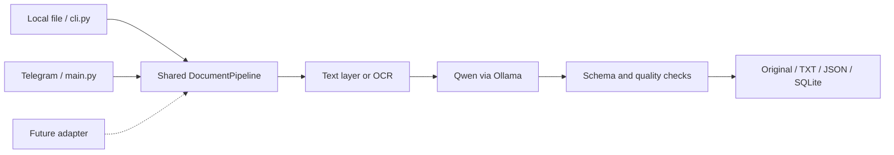

# Scan Everything

**English** | [Русский](README.ru.md)

### Local documents → Qwen → structured facts

A practical Python example for local document processing. No mandatory Telegram,
no cloud LLM by default, and no bundled web interface.

Extract text, identify the people and organizations involved, and save useful
structured fields instead of presenting a wall of raw OCR.

This project grew out of a private system called LUX. The reusable processing core,
an optional Telegram adapter, and setup lessons are shared here. The private LUX
interface, HTML/CSS, icons, documents, credentials, and server configuration are not.

“Everything” is a project name, not a promise of universal format support:
the example handles PDF, DOCX, JPG/JPEG, and PNG. It is an MVP, not an accounting system.

## What is included?

- PyMuPDF / python-docx text extraction; Tesseract for images and PDF pages without text.
- **Qwen3-VL 4B Instruct through Ollama** for local semantic extraction.
- JSON Schema + Pydantic, conservative checks, and `null` for uncertain facts.
- Original files, full TXT, metadata JSON, and a searchable SQLite index.
- A local-file CLI and an optional Telegram bot demonstrating an input adapter.
- Setup, automation, recognition-quality guides, and a reusable [AI-agent skill](skills/lux-document-workflows/SKILL.md).



## Quick start · Windows

Install Python 3.12, [Ollama](https://docs.ollama.com/windows), and
[Tesseract](https://tesseract-ocr.github.io/tessdoc/Installation.html).
Download **Code → Download ZIP**, extract it, and open PowerShell in the project folder.

```powershell
py -3.12 -m venv .venv
.\.venv\Scripts\python.exe -m pip install -r requirements.txt
Copy-Item .env.example .env
ollama pull qwen3-vl:4b-instruct
.\.venv\Scripts\python.exe cli.py 'C:\Samples\invoice.pdf' --output-dir '.\data'
```

Only copy `.env.example` on first setup; do not overwrite an existing `.env`.
Set `TESSERACT_CMD` and the installed OCR languages there. Start Ollama before the
CLI. The example configuration selects `ollama` on port 11434; no API key is needed.
Follow the complete [Qwen setup guide](docs/SETUP.md) if this is your first installation.

The CLI prints an ID and output paths, not your document contents. Submitting the
same file again creates a new record; it does not update the previous record.

## Guides

| Goal | Read |
|---|---|
| Install and connect Qwen | [Setup](docs/SETUP.md) |
| Understand the original PC/server architecture | [LUX integration](docs/INTEGRATION.md) |
| Automate processing or add an input source | [Automation](docs/AUTOMATION.md) |
| Run the optional Telegram example | [Telegram](docs/TELEGRAM.md) |
| Improve messy extraction without inventing facts | [Recognition quality](docs/RECOGNITION.md) |
| Ask another AI to configure or extend the project | [SKILL.md](skills/lux-document-workflows/SKILL.md) + [AGENTS.md](AGENTS.md) |
| Diagnose a failure | [Troubleshooting](docs/TROUBLESHOOTING.md) |

## Why recognition improved

Early rules reused OCR lines as titles and summaries. The improvement came from a
vision model, explicit sender/recipient/counterparty roles, a response schema, and
postprocessing. **There was no fine-tuning or self-training.** Pydantic validates
structure, not truth. Check important names, amounts, and deadlines against the original.

## Test without tokens or a real model

```powershell
.\.venv\Scripts\python.exe main.py --check
.\.venv\Scripts\python.exe -m unittest discover -s tests -v
```

Mock tests verify code paths, not real AI accuracy. GitHub Actions runs the same
checks. Dependencies use version ranges; a fully reproducible lockfile is not included.

## Current limitations

- JPG/PNG receive image input; PDF/DOCX supply extracted text, not rendered pages.
- A bad but nonempty PDF text layer bypasses OCR. Embedded DOCX images are not read.
- Empty OCR stops the pipeline. Ollama receives at most 18,000 text characters.
- Address checks are heuristics, not postal-address verification.
- Folder watchers, email/cloud adapters, a public REST API, UI, and multi-user authentication are not implemented.
- File writes and SQLite do not share a transaction; failures can leave partial output.

## Give this to an AI agent

> Read AGENTS.md and skills/lux-document-workflows/SKILL.md. Set up local Qwen and
> verify one agreed test document through cli.py. The private web panel is deliberately
> excluded. Do not publish documents or enable a cloud API.

The skill is ordinary Markdown. You can also copy its folder into your tool's skill
directory. Project paths in the skill refer to this checkout.

## Languages, contributions, and privacy

English is the primary documentation and example-output language. The
[Russian introduction](README.ru.md) provides an alternative starting point;
the detailed guides are currently English-only. Names, addresses, and extracted
source text retain their original language. OCR languages are configured separately.

Read [CONTRIBUTING](CONTRIBUTING.md) and [SECURITY](SECURITY.md).
The owner has not selected a source license yet: public visibility alone does not
grant unrestricted reuse. Models and dependencies have their own licenses.
