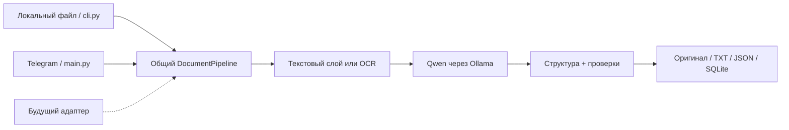

# Scan Everything

[English](README.md) | **Русский**

Основная документация, сообщения примера и навык ИИ — на английском. Эта страница
содержит русское введение; ссылки на подробные руководства ведут на английские версии.

### Local documents → Qwen → structured facts

**Практический Python-пример локального разбора документов — без чужого интерфейса,
без облачного LLM по умолчанию, без обязательного Telegram.**

Проект вырос из личной системы LUX: документы поступали через бота, обрабатывались
на компьютере и отображались в частной панели. Здесь опубликованы переиспользуемое
ядро, пример бота и опыт настройки. Сам интерфейс LUX, HTML/CSS, иконки, личные
документы и серверные настройки **не входят** в репозиторий.

Название — идея проекта, не обещание читать все форматы: поддерживаются PDF,
DOCX, JPG/JPEG и PNG. Это MVP/учебный пример, не бухгалтерская система.

## Что внутри

- Извлечение текста через PyMuPDF / python-docx; Tesseract для фото и пустых PDF-страниц.
- **Qwen3-VL 4B Instruct через Ollama**: локальная vision-модель для смысла и полей.
- JSON Schema + Pydantic, проверки дат/адресов и консервативные `null` вместо догадок.
- Оригинал + полный TXT + JSON + SQLite с поиском.
- CLI для локального файла; Telegram-бот как отдельный пример адаптера.
- Гайды по автоматизации, реальным ошибкам и переносимый [навык ИИ](skills/lux-document-workflows/SKILL.md).



## Быстрый старт · Windows

Установите Python 3.12, [Ollama](https://docs.ollama.com/windows) и
[Tesseract](https://tesseract-ocr.github.io/tessdoc/Installation.html).
Скачайте исходники: **Code → Download ZIP**, распакуйте и откройте PowerShell в корне.

```powershell
py -3.12 -m venv .venv
.\.venv\Scripts\python.exe -m pip install -r requirements.txt
Copy-Item .env.example .env
ollama pull qwen3-vl:4b-instruct
.\.venv\Scripts\python.exe cli.py 'C:\Samples\invoice.pdf' --output-dir '.\data'
```

Не перезаписывайте существующий `.env`. В нём задайте реальный `TESSERACT_CMD` и
установленные языки. Ollama должна работать до запуска CLI. `.env.example` уже
выбирает `ollama` и порт 11434; ключ API для этого не нужен.
Полный гайд: **[подключить Qwen и сделать первый разбор](docs/SETUP.md)**.

Результат CLI — ID и файлы в выбранном каталоге. Содержимое документов не печатается
в терминал автоматически. Повторный запуск создаёт новую запись, не обновляет прежнюю.

## Читать по порядку

| Задача | Материал |
|---|---|
| Скачать, установить, подключить Qwen | [SETUP](docs/SETUP.md) |
| Понять исходную интеграцию LUX | [INTEGRATION](docs/INTEGRATION.md) |
| Автоматизировать / добавить другой источник | [AUTOMATION](docs/AUTOMATION.md) |
| Запустить Telegram-пример | [TELEGRAM](docs/TELEGRAM.md) |
| Исправить «кашу», не выдумывая поля | [RECOGNITION](docs/RECOGNITION.md) |
| Дать задачу другой нейросети | [SKILL.md](skills/lux-document-workflows/SKILL.md) + [AGENTS.md](AGENTS.md) |
| Разобраться с неисправностями | [TROUBLESHOOTING](docs/TROUBLESHOOTING.md) |

## Почему это стало читать лучше

Первые правила просто превращали OCR в заголовок/описание. Улучшение дали:
vision-модель, разделение отправителя/получателя/контрагента, явная схема ответа и
постобработка. **Это не fine-tuning и не самообучение.** Pydantic подтверждает
формат, а не правдивость. Важные суммы, имена и сроки сверяйте с оригиналом.

## Проверить без токенов и реальной модели

```powershell
.\.venv\Scripts\python.exe main.py --check
.\.venv\Scripts\python.exe -m unittest discover -s tests -v
```

Mock-тесты проверяют работу кода, не качество реального AI. GitHub Actions запускает
те же проверки. Зависимости указаны диапазонами; полностью воспроизводимого lock-файла нет.

## Ограничения

- Изображение модели передаётся для JPG/PNG. PDF/DOCX — извлечённый текст, не vision страниц.
- Непустой, но плохой текстовый слой PDF не вызывает OCR. Картинки внутри DOCX не читаются.
- Пустой OCR останавливает pipeline. Ollama получает максимум 18 000 символов текста.
- Адресная проверка — эвристика, не проверка по адресному справочнику.
- Watch-folder, email/cloud adapters, публичный REST API, UI и multi-user auth здесь не реализованы.
- Запись файлов/SQLite не образует общей транзакции; после сбоя возможны частичные результаты.

## Для ИИ-агента

> Прочитай AGENTS.md и skills/lux-document-workflows/SKILL.md. Настрой локальный
> Qwen и проверь один согласованный тестовый документ через cli.py. Не ищи здесь
> веб-панель: она намеренно исключена. Не публикуй данные и не включай облачный API.

Навык читается как обычный Markdown; папку можно перенести в каталог навыков
выбранного инструмента. Проектные пути в навыке относятся к этому checkout.

## Участие и приватность

Читайте [CONTRIBUTING](CONTRIBUTING.md) и [SECURITY](SECURITY.md).
Лицензию исходников владелец пока не выбрал: публичность сама по себе не означает
неограниченного разрешения на использование. Модель и зависимости имеют свои лицензии.
